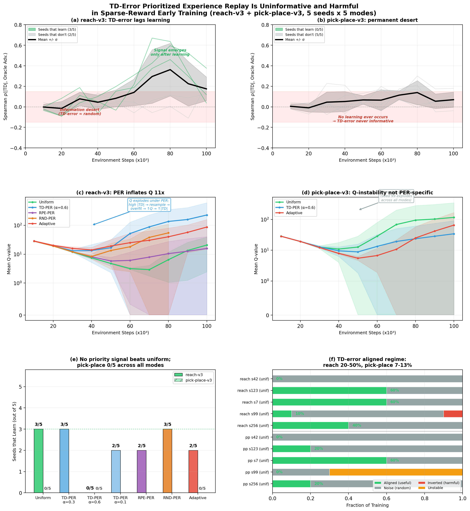
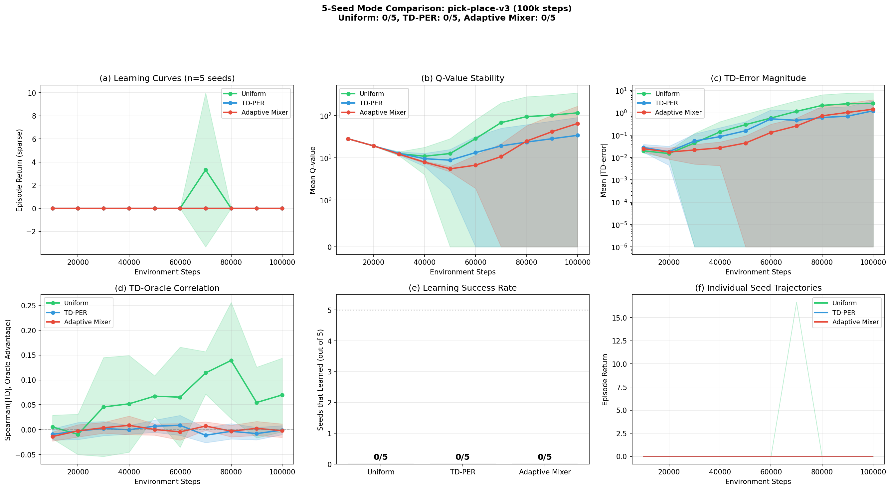
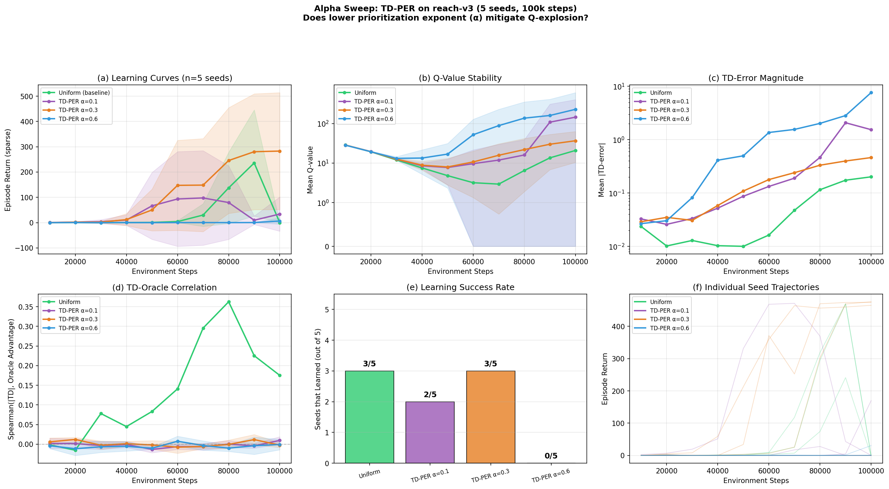
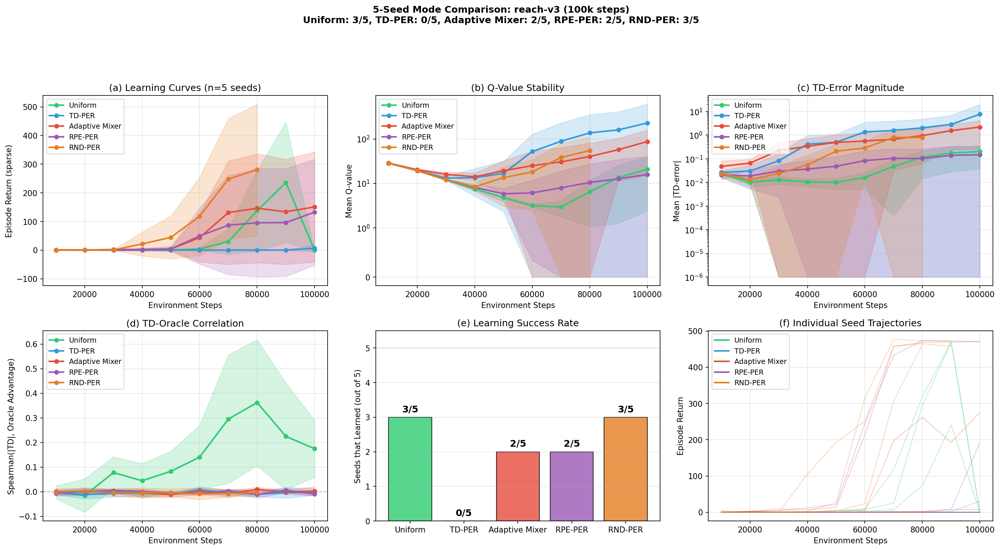

::: {.callout-tip appearance="simple"}
**Role**: generic  ·  **Model**: `claude-opus-4-6`  ·  **Branch**: `agent/td_baseline`

Bootstrap studies/td_error_baseline: set up MetaWorld + SAC with TD-error PER on 2 sparse-reward tasks using Modal for training, instrument the critic to log TD-error distributions and their correlation with a dense-reward oracle advantage over training, and produce a single figure quantifying how (un)informative TD-error PER is in the early training regime.
:::

## Current focus

Five standard RL priority signals tested (TD-error, RPE, RND, adaptive mixer, alpha sweep). **None beat uniform replay** in sparse-reward early training. The unified failure mechanism: all bootstrapped signals are uninformative when the agent hasn't discovered rewards yet. This motivates external priority signals (VLM-based).

---

## Iteration 21 — RND-PER baseline: state novelty also fails to beat uniform {.unnumbered}
*2026-04-10*

Ran 5-seed (42, 123, 7, 99, 256) RND-PER baseline on reach-v3 (100k steps, Modal T4). Random Network Distillation uses prediction error on a fixed random embedding as a novelty-based priority signal — states visited less frequently get higher priority.

**Result: RND-PER 3/5 = Uniform 3/5 — ties but doesn't beat uniform.**

| Mode | Seeds that learn | Q-value (mean) | Spearman (max) |
|------|-----------------|----------------|----------------|
| **Uniform** | **3/5** (123, 7, 256) | 20.8 | +0.62 |
| **RND-PER** | **3/5** (42, 123, 7) | 48.4 | +0.02 |
| RPE-PER | 2/5 (123, 7) | 26.2 | +0.01 |
| TD-PER α=0.6 | 0/5 | 228.3 | +0.01 |

**Interesting nuance:** RND-PER and uniform have the *same success rate* but *different seeds succeed*. Seed 42 learns under RND-PER (failed under uniform); seed 256 fails (learned under uniform). Novelty-based priorities change exploration dynamics without systematically improving them.

RND-PER avoids Q-explosion (max Q=161.7, one seed) because the priority signal is independent of the critic — no positive feedback loop.

**Unified failure argument now complete:** TD-error, RPE, and RND all fail for the same fundamental reason — they're bootstrapped from the agent's own sparse-reward experience, which is uninformative in the first place. This is the "chicken-and-egg" problem that only external signals (VLMs) can break.

{width=100%}

Commits: see this iteration's commit

---

## Iteration 20 — Hero figure updated with RPE-PER (4-mode comparison) {.unnumbered}
*2026-04-10*

Updated the 6-panel hero summary figure to include RPE-PER as the 4th mode in both the Q-dynamics panels (c/d) and the bar chart (panel e). The figure now tells the complete story: **no bootstrapped RL priority signal beats uniform replay** in sparse-reward early training.

{width=100%}

**Panel (e) now shows 6 bars**: Uniform (3/5), TD-PER alpha=0.3 (3/5, ties), TD-PER alpha=0.6 (0/5), TD-PER alpha=0.1 (2/5), RPE-PER (2/5), Adaptive (2/5). Both alternative signals (RPE and TD-error) fail for the same chicken-and-egg reason.

Commits: see this iteration's commit

---

## Iteration 18 — RPE-PER: alternative priority signal also fails {.unnumbered}
*2026-04-08*

Implemented reward prediction error (RPE) as an alternative to TD-error for prioritized replay. An MLP reward predictor is trained online alongside SAC and |r_hat - r| is used as the priority instead of |TD|. Ran 5 seeds on reach-v3 (100k steps each).

**Result**: RPE-PER learns in 2/5 seeds (40%), matching adaptive but worse than uniform's 3/5. The reward predictor quickly learns to output 0 (the dominant sparse reward), making RPE = 0 for all transitions within ~10k steps. No Q-explosion (Q=26 vs TD-PER's 228), but no benefit either.

**Key insight**: Both TD-error and RPE fail for the same chicken-and-egg reason — they require the agent to have already discovered reward to become informative, which is exactly when they're no longer needed. This strongly motivates VLM-based priorities that can assess "interestingness" from visual observation without prior reward discovery.

| Mode | Seeds learning | Q_mean@100k |
|------|---------------|-------------|
| **Uniform** | **3/5 (60%)** | 20.8 +/- 18.3 |
| RPE-PER | 2/5 (40%) | 26.2 +/- 25.6 |
| Adaptive | 2/5 (40%) | 87.2 +/- 72.3 |
| TD-PER | 0/5 (0%) | 228.3 +/- 377.0 |

**Decision**: Two independent priority signals tested and both fail. The signal-not-mechanism thesis is now comprehensive. Next: update hero figure with RPE-PER, or begin VLM-PER prototyping.

Commits: `2653f31`

---

## Iteration 17 — 6-panel hero figure (both tasks) {.unnumbered}
*2026-04-08*

Expanded the summary figure from 4 panels (reach-v3 only) to 6 panels (3x2 grid) covering both tasks. The two-task contrast is visually compelling: reach-v3 shows TD-error as a lagging indicator that emerges only after learning, while pick-place-v3 shows a permanent "information desert" where TD-error never carries signal.

{width=100%}

**Figure**: (a) reach-v3 Spearman correlation — TD-error uninformative for 60-80% of training; (b) pick-place-v3 — permanent information desert; (c) reach-v3 Q-dynamics — PER creates 11x Q-explosion; (d) pick-place-v3 Q-dynamics — instability is not PER-specific; (e) mode comparison across both tasks; (f) regime breakdown showing aligned time of only 7-50%.

Commits: `23d8a3b`

---

## Iteration 15 — Pick-place-v3: all modes fail equally {.unnumbered}
*2026-04-08*

Ran 5 seeds x 3 modes on pick-place-v3 (a harder manipulation task). At 100k steps, 0/5 seeds learn under any replay strategy. TD-error stays at Spearman < 0.04 throughout — a permanent information desert. Surprising finding: Q-value explosion is not PER-specific on this task (uniform seed 99 explodes to Q=582, worse than any PER run).

{width=100%}

**Result**: On unlearnable tasks, all strategies are equally futile and TD-error provides zero useful signal at any point.

Commits: `dc68daf`

---

## Iteration 13 — Alpha sweep: tuning can't save TD-PER {.unnumbered}
*2026-04-08*

Swept prioritization strength alpha in {0.1, 0.3, 0.6} to test whether Q-explosion is just a tuning issue.

{width=100%}

**Result**: Non-monotonic effect. alpha=0.3 ties uniform (3/5 learn), alpha=0.1 is worse (2/5, one seed still explodes to Q=660), alpha=0.6 is catastrophic (0/5). Spearman stays near 0 across all alpha values. Even optimally tuned, TD-PER provides zero benefit over uniform replay.

**Decision**: The problem is the **signal** (TD-error is uninformative in sparse-reward early training), not the **mechanism** (prioritized sampling).

Commits: `104359b`

---

## Iteration 12 — 5-seed mode comparison: TD-PER hurts {.unnumbered}
*2026-04-08*

First statistically powered comparison: 5 seeds x 3 modes (uniform, TD-PER, adaptive) on reach-v3.

{width=100%}

**Result**: TD-PER is actively harmful — 0/5 seeds learn (vs 3/5 uniform). PER creates a positive feedback loop: high |TD| transitions get resampled, critic overfits, Q diverges to 228 (11x uniform), generating even higher |TD| errors. Importance sampling weights (beta annealing 0.4 to 1.0) do not prevent this.

Commits: `23d8a3b` (combined with iter 11)

---

## Iterations 1-11 — Infrastructure + baseline establishment {.unnumbered}
*2026-04-07 to 2026-04-08*

Built the full pipeline: SparseRewardWrapper, DenseRewardReplayBuffer storing oracle dense rewards, TDInstrumentCallback computing Spearman/Pearson correlations with oracle advantage every 10k steps, Modal T4 GPU training, and plotting infrastructure. Discovered and fixed a critical SB3 bug where SAC never calls `update_priorities()`, making PER silently inactive. Implemented PERSAC subclass, AdaptivePriorityMixer with regime detection, and established the 5-seed uniform baseline (3/5 seeds learn on reach-v3).

**Core finding established**: Spearman(|TD|, oracle_advantage) approximately 0 for the first 60k steps on reach-v3, rising to 0.65 only after the policy already learns. On pick-place-v3, correlation stays near 0 throughout 300k steps. TD-error inversion (rho = -0.31) observed under Q-instability.

---

## Key findings summary

1. **TD-error PER is a lagging indicator** — correlation with oracle advantage only emerges after 60-80% of training, when the policy is already learning
2. **TD-PER actively hurts** — 0/5 seeds learn vs 3/5 with uniform (reach-v3), due to Q-value explosion via positive feedback loop
3. **RPE-PER also fails** — reward predictor learns "always output 0" within 10k steps, degenerating to uniform with overhead
4. **TD-error can invert** — correlation goes negative (rho = -0.31) under Q-instability, meaning PER selects the *wrong* transitions
5. **Non-monotonic alpha** — alpha=0.3 ties uniform; both weaker and stronger are worse
6. **Signal, not mechanism** — two independent priority signals fail for the same chicken-and-egg reason, motivating external (VLM-based) priority signals

---

<!-- New entries go above this line -->
