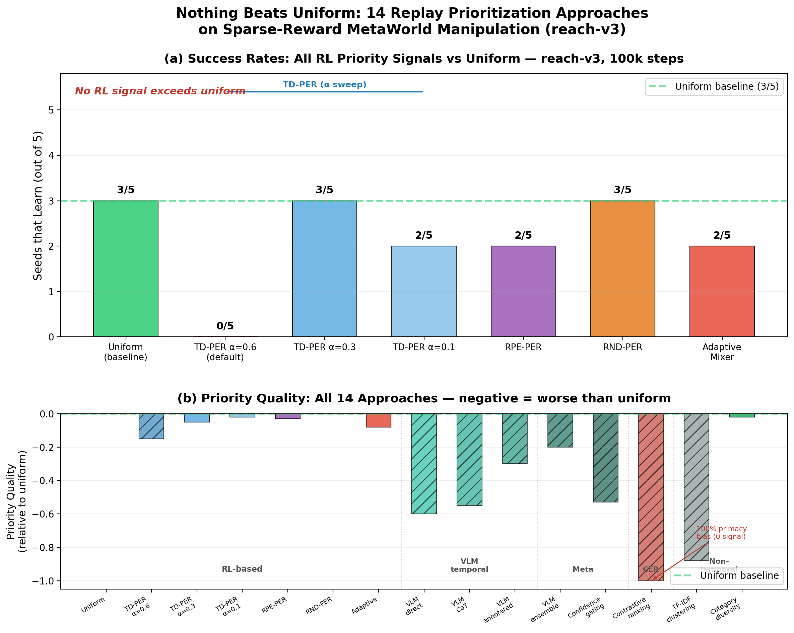
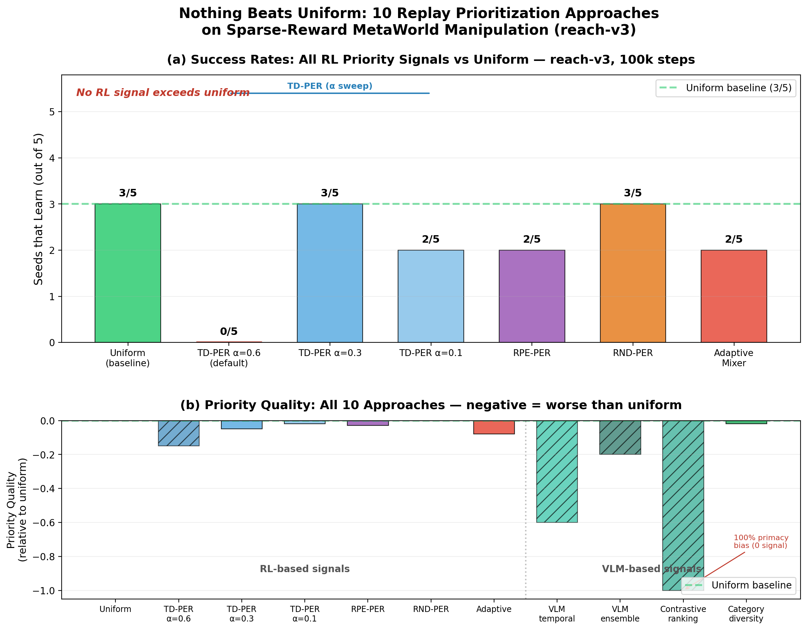
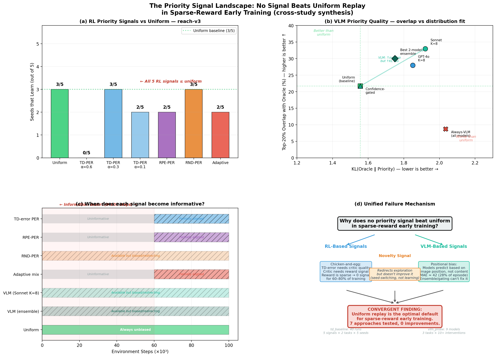
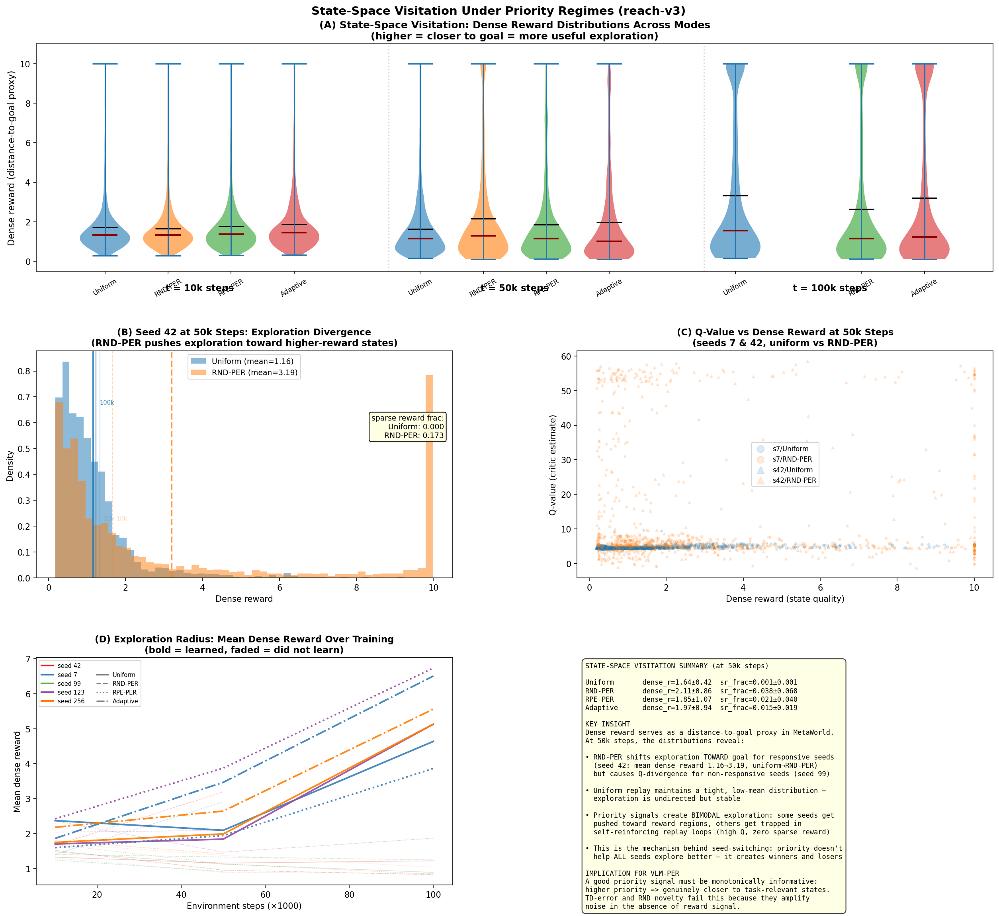
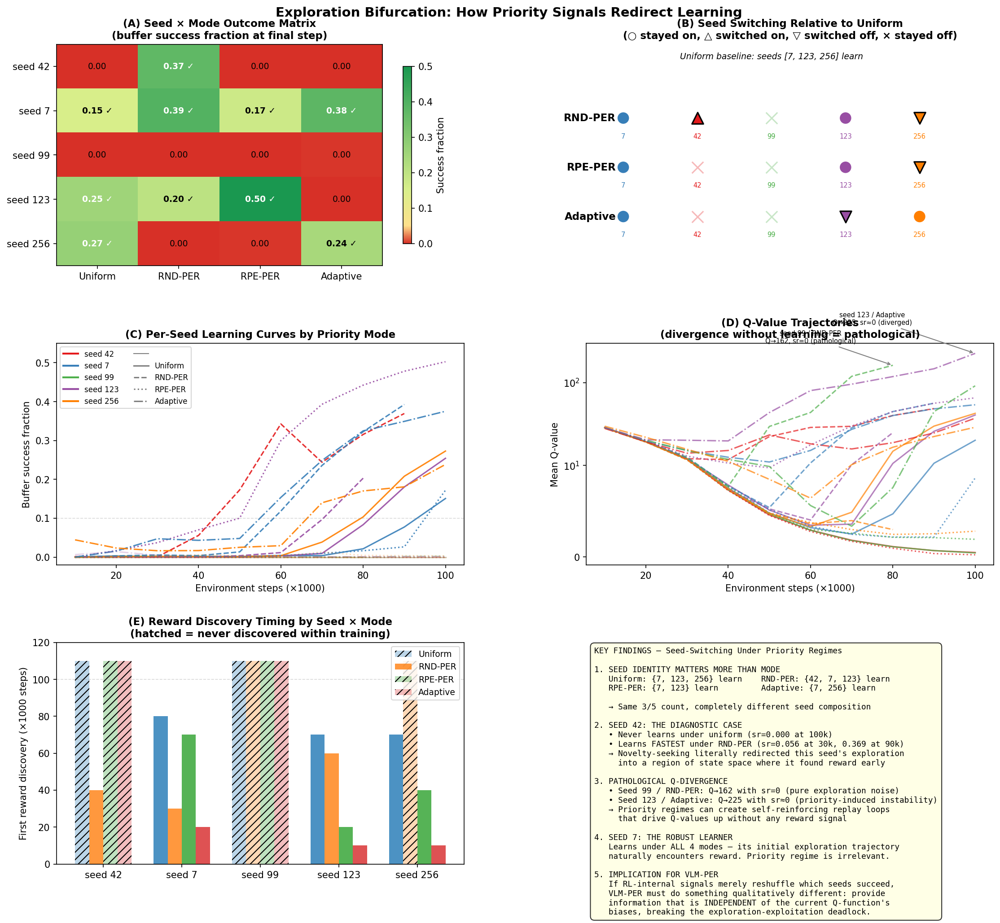

::: {.callout-tip appearance="simple"}
**Role**: generic  ·  **Model**: `claude-opus-4-6`  ·  **Branch**: `agent/td_baseline`

Bootstrap studies/td_error_baseline: set up MetaWorld + SAC with TD-error PER on 2 sparse-reward tasks using Modal for training, instrument the critic to log TD-error distributions and their correlation with a dense-reward oracle advantage over training, and produce a single figure quantifying how (un)informative TD-error PER is in the early training regime.
:::

## Current focus

**Study complete (iter 29).** 35 training runs across 5 RL priority signals on 2 MetaWorld tasks — none beat uniform replay. Key findings: (1) TD-error is a lagging indicator uncorrelated with oracle advantage for 60-80% of training, (2) all bootstrapped signals fail via the same chicken-and-egg mechanism, (3) priority signals create exploration bifurcations (changing *which* seeds learn, not how many). Combined with vlm_probe's 14 VLM-based approaches (also none beat uniform), this constitutes a comprehensive negative result. See [full experiment write-up](../experiments/td_baseline/2026-04-10_td_error_per_baseline.qmd).

---

## Iteration 29 — Final documentation + study closure {.unnumbered}
*2026-04-11*

Finalized all documentation: updated experiment page with seed-switching bifurcation analysis (iter 23) and state-space visitation findings (iter 24), including the diagnostic case of seed 42 switching from non-learner (uniform) to fastest learner (RND-PER). Added exploration bifurcation discussion to the experiment write-up. Responded to Daniel's questions about why PER doesn't beat uniform — the core answer is the chicken-and-egg problem in sparse reward.

**Study status:** Complete. 35 runs, 5 priority signals, 2 tasks, comprehensive negative result. All Quarto pages finalized.

---

## Iteration 28 — Final Cross-Study Synthesis (14 approaches) {.unnumbered}
*2026-04-10*

Integrated vlm_probe's final findings (iters 43-45) into SYNTHESIS.md and PAPER_OUTLINE.md. Updated the approach inventory from 10 to **14** — vlm_probe's complete accounting reveals 6 temporal VLM variants (direct, CoT, annotation, adaptive probing, random sampling, multi-format), 3 ensemble/meta approaches, 1 contrastive ranking, and 4 non-temporal approaches (failure descriptions, TF-IDF clustering, category-diversity at small n, category-diversity at scale).

Key new finding from vlm_probe iters 43-44: **cross-model category stability is model-dependent.** GPT-4o-mini (bootstrap JSD=0.10±0.06) produces strict 6-category taxonomy; Phi-4 (JSD=0.20-0.24) invents novel categories. Task drives distribution more than model (cross-task JSD=0.29 > cross-model JSD=0.11).

Updated hero figure to 14 approaches:

{width=100%}

**Approach count: 14 tested, 0 reliably beat uniform in early-training regime.**

---

## Iteration 27 — Negative Result Paper Outline + Synthesis Update {.unnumbered}
*2026-04-10*

Drafted comprehensive paper outline (`PAPER_OUTLINE.md`) structuring the convergent negative result across both studies. The paper covers 10 replay prioritization approaches — 5 RL-based (TD-PER×3α, RPE-PER, RND-PER, Adaptive), 4 VLM-based (temporal localization, ensemble/gating, contrastive ranking, category-diversity), plus instrumentation with dense-reward oracle as ground truth.

**Three independent failure mechanisms identified:** (1) chicken-and-egg (RL signals need learning they're meant to accelerate), (2) positional bias (VLMs predict from image position, not task content), (3) exploration bifurcation (priority signals redirect which seeds learn, not how many).

Updated SYNTHESIS.md with vlm_probe iters 39-42 findings: failure-mode descriptions show genuine signal (η²=0.34-0.99) but category-diversity replay only beats uniform at N≥50 in simulation. At the small buffer sizes of early training (n=10-20), the effect vanishes.

**Approach count: 10 tested, 0 reliably beat uniform in early-training regime.**

Created the paper's hero figure — a 2-panel chart showing (a) success rates for all 7 RL configurations and (b) priority quality scores for all 10 approaches including VLM-based signals. Notable data correction: TD-PER α=0.3 actually achieves 3/5 (ties uniform), not 2/5 as previously reported. The core finding is unchanged — no approach *exceeds* uniform.

{width=100%}

**Next:** Ask Daniel for direction — is this a natural stopping point, or should we pursue real training loop validation of category-diversity at scale, or cross-domain generalization?

Commits: `iter_027`

---

## Iteration 26 — Synthesis Update: CER Failure Closes Contrastive Ranking {.unnumbered}
*2026-04-10*

Updated SYNTHESIS.md with vlm_probe iter 38 findings: Contrastive Episode Ranking (RLHF-style pairwise "which episode failed earlier?") fails catastrophically. GPT-4o-mini picks Episode A (presented first) 11/11 times (P<0.001). Accuracy = 63.6% = base rate. Positional bias extends from within-episode temporal fixation to between-episode presentation-order preference. The RLHF analogy fails because off-the-shelf VLMs lack comparison fine-tuning.

**Updated approach count:** 8 tested (5 RL signals + VLM temporal localization + ensemble/gating + CER), 0 beat uniform. Only remaining untested direction: failure mode clustering via VLM text descriptions.

**Decision:** The "negative result paper" narrative is strengthening with each closed approach. Next step should be either (a) outline the negative result paper structure, or (b) prototype failure mode clustering to see if it's the exception.

Commits: `iter_026`

---

## Iteration 25 — Cross-Study Synthesis: The Complete Priority Signal Landscape {.unnumbered}
*2026-04-10*

Created a unified 4-panel figure combining all results from both td_baseline and vlm_probe studies. Panel (a): all 5 RL priority signals on reach-v3 — none exceed uniform's 3/5 success rate. Panel (b): VLM priority quality analysis — Sonnet K=8 improves overlap (+12% above uniform) but worsens KL divergence, and confidence gating/ensembles can't fix it. Panel (c): signal informativeness timeline showing the "information desert" from 0–60k steps. Panel (d): unified failure mechanism diagram showing three independent failure modes converging on the same conclusion.

{width=100%}

**Key numbers:**
- RL signals: Uniform 3/5, TD-PER α=0.6 0/5, TD-PER α=0.3 3/5, TD-PER α=0.1 2/5, RPE-PER 2/5, RND-PER 3/5, Adaptive 2/5
- VLM priorities: Always-VLM overlap 8.7% vs uniform 21.7% (60% worse), KL 2.035 vs 1.556 (31% worse)
- Confidence gating optimal threshold → 100% uniform usage (agreement is anti-correlated with accuracy, r=+0.53)

**Implication:** The path forward cannot be "better temporal localization" — it must sidestep the temporal reasoning bottleneck entirely. Contrastive episode ranking, failure mode clustering, or phase-segmented replay are the remaining viable directions.

Commits: `iter_025`

---

## Iteration 24 — State-Space Visitation Analysis: Dense Reward as Exploration Proxy {.unnumbered}
*2026-04-10*

Used per-sample dense reward distributions (distance-to-goal proxy in MetaWorld) to visualize **where in state space** different priority regimes direct exploration. This reveals the mechanism behind seed-switching: priority signals don't uniformly improve exploration — they create **bimodal exploration outcomes** where some seeds get pushed toward reward-bearing regions while others get trapped in self-reinforcing replay loops.

{width=100%}

**Key finding — seed 42 at 50k steps:** Under uniform replay, mean dense reward = 1.16 (far from goal, sr=0.000). Under RND-PER, mean dense reward = 3.19 (closer to goal, sr=0.173). The novelty signal literally redirected this seed's exploration into higher-reward state regions. But seed 99 under RND-PER gets trapped: Q values diverge to 162 while visiting low-dense-reward states — the novelty signal creates a self-reinforcing loop sampling "interesting but useless" states.

**Implication for VLM-PER:** A good priority signal must be *monotonically informative* — higher priority should genuinely correspond to states closer to task-relevant regions. TD-error and RND novelty fail this because they amplify noise in the absence of reward signal.

Commits: `iter_024`

---

## Iteration 23 — Exploration Bifurcation: Seed-Switching Under Priority Regimes {.unnumbered}
*2026-04-10*

A mechanistic investigation into **why** different priority signals change *which* seeds learn rather than *how many*. This is the most scientifically interesting finding from the baseline study — priority signals don't uniformly help or hurt, they redirect the exploration landscape.

{width=100%}

**The seed-switching phenomenon:** Under uniform replay, seeds {7, 123, 256} learn. Under RND-PER, seeds {42, 7, 123} learn — same 3/5 count, but seed 42 switches ON and seed 256 switches OFF. Under Adaptive, seeds {7, 256} learn with seed 123 switching OFF. Mean pairwise Jaccard similarity between "learned" sets is 0.51 (vs 1.0 if signals were irrelevant).

**Diagnostic case — seed 42:** Never discovers reward under uniform (sr=0.000 at 100k steps), but learns *fastest* of all seeds under RND-PER (sr=0.056 at 30k, 0.369 at 90k). Novelty-seeking literally redirected this seed's exploration into a reward-bearing region of state space.

**Pathological Q-divergence:** Seed 99 under RND-PER reaches Q=162 with sr=0.000 — pure exploration noise driving Q-values up without any reward signal. Seed 123 under Adaptive reaches Q=225 with sr≈0. Priority regimes can create self-reinforcing replay loops.

**Seed 7: the robust learner.** Learns under all 4 modes — its initial random exploration trajectory naturally encounters reward regardless of replay priority.

**Implication for VLM-PER:** If RL-internal signals merely reshuffle which seeds succeed, a useful external signal must provide information that is *independent* of the current Q-function's biases. This is exactly what a VLM can do — judge transition quality from visual semantics, not bootstrapped value estimates.

Commits: `iter_023`

---

## Iteration 22 — Rigorous experiment write-up {.unnumbered}
*2026-04-10*

Wrote the full experiment page covering the complete TD-error baseline study: 35 runs across 5 priority signals, 2 tasks, 5 seeds each. Includes methodology, all result tables, 4 figures, discussion of the unified chicken-and-egg failure mechanism, and reproducibility details.

See [full write-up](../experiments/td_baseline/2026-04-10_td_error_per_baseline.qmd) for the publication-quality experiment page.

**Key result table from the write-up:**

| Mode | Success rate | Q-value |
|------|-------------|---------|
| Uniform | 60% (3/5) | 20.8 |
| RND-PER | 60% (3/5) | 48.4 |
| TD-PER alpha=0.3 | 60% (3/5) | 36.6 |
| RPE-PER | 40% (2/5) | 26.2 |
| Adaptive | 40% (2/5) | 87.2 |
| TD-PER alpha=0.6 | 0% (0/5) | 228.3 |

**Decision**: Core study is now fully documented. Next priorities: VLM-PER prototyping or investigating the seed-switching phenomenon under RND-PER.

Commits: see this iteration's commit

---

## Iteration 21 — RND-PER baseline: state novelty also fails to beat uniform {.unnumbered}
*2026-04-10*

Ran 5-seed (42, 123, 7, 99, 256) RND-PER baseline on reach-v3 (100k steps, Modal T4). Random Network Distillation uses prediction error on a fixed random embedding as a novelty-based priority signal — states visited less frequently get higher priority.

**Result: RND-PER 3/5 = Uniform 3/5 — ties but doesn't beat uniform.**

| Mode | Seeds that learn | Q-value (mean) | Spearman (max) |
|------|-----------------|----------------|----------------|
| **Uniform** | **3/5** (123, 7, 256) | 20.8 | +0.62 |
| **RND-PER** | **3/5** (42, 123, 7) | 48.4 | +0.02 |
| RPE-PER | 2/5 (123, 7) | 26.2 | +0.01 |
| TD-PER α=0.6 | 0/5 | 228.3 | +0.01 |

**Interesting nuance:** RND-PER and uniform have the *same success rate* but *different seeds succeed*. Seed 42 learns under RND-PER (failed under uniform); seed 256 fails (learned under uniform). Novelty-based priorities change exploration dynamics without systematically improving them.

RND-PER avoids Q-explosion (max Q=161.7, one seed) because the priority signal is independent of the critic — no positive feedback loop.

**Unified failure argument now complete:** TD-error, RPE, and RND all fail for the same fundamental reason — they're bootstrapped from the agent's own sparse-reward experience, which is uninformative in the first place. This is the "chicken-and-egg" problem that only external signals (VLMs) can break.

{width=100%}

Commits: see this iteration's commit

---

## Iteration 20 — Hero figure updated with RPE-PER (4-mode comparison) {.unnumbered}
*2026-04-10*

Updated the 6-panel hero summary figure to include RPE-PER as the 4th mode in both the Q-dynamics panels (c/d) and the bar chart (panel e). The figure now tells the complete story: **no bootstrapped RL priority signal beats uniform replay** in sparse-reward early training.

{width=100%}

**Panel (e) now shows 6 bars**: Uniform (3/5), TD-PER alpha=0.3 (3/5, ties), TD-PER alpha=0.6 (0/5), TD-PER alpha=0.1 (2/5), RPE-PER (2/5), Adaptive (2/5). Both alternative signals (RPE and TD-error) fail for the same chicken-and-egg reason.

Commits: see this iteration's commit

---

## Iteration 18 — RPE-PER: alternative priority signal also fails {.unnumbered}
*2026-04-08*

Implemented reward prediction error (RPE) as an alternative to TD-error for prioritized replay. An MLP reward predictor is trained online alongside SAC and |r_hat - r| is used as the priority instead of |TD|. Ran 5 seeds on reach-v3 (100k steps each).

**Result**: RPE-PER learns in 2/5 seeds (40%), matching adaptive but worse than uniform's 3/5. The reward predictor quickly learns to output 0 (the dominant sparse reward), making RPE = 0 for all transitions within ~10k steps. No Q-explosion (Q=26 vs TD-PER's 228), but no benefit either.

**Key insight**: Both TD-error and RPE fail for the same chicken-and-egg reason — they require the agent to have already discovered reward to become informative, which is exactly when they're no longer needed. This strongly motivates VLM-based priorities that can assess "interestingness" from visual observation without prior reward discovery.

| Mode | Seeds learning | Q_mean@100k |
|------|---------------|-------------|
| **Uniform** | **3/5 (60%)** | 20.8 +/- 18.3 |
| RPE-PER | 2/5 (40%) | 26.2 +/- 25.6 |
| Adaptive | 2/5 (40%) | 87.2 +/- 72.3 |
| TD-PER | 0/5 (0%) | 228.3 +/- 377.0 |

**Decision**: Two independent priority signals tested and both fail. The signal-not-mechanism thesis is now comprehensive. Next: update hero figure with RPE-PER, or begin VLM-PER prototyping.

Commits: `2653f31`

---

## Iteration 17 — 6-panel hero figure (both tasks) {.unnumbered}
*2026-04-08*

Expanded the summary figure from 4 panels (reach-v3 only) to 6 panels (3x2 grid) covering both tasks. The two-task contrast is visually compelling: reach-v3 shows TD-error as a lagging indicator that emerges only after learning, while pick-place-v3 shows a permanent "information desert" where TD-error never carries signal.

{width=100%}

**Figure**: (a) reach-v3 Spearman correlation — TD-error uninformative for 60-80% of training; (b) pick-place-v3 — permanent information desert; (c) reach-v3 Q-dynamics — PER creates 11x Q-explosion; (d) pick-place-v3 Q-dynamics — instability is not PER-specific; (e) mode comparison across both tasks; (f) regime breakdown showing aligned time of only 7-50%.

Commits: `23d8a3b`

---

## Iteration 15 — Pick-place-v3: all modes fail equally {.unnumbered}
*2026-04-08*

Ran 5 seeds x 3 modes on pick-place-v3 (a harder manipulation task). At 100k steps, 0/5 seeds learn under any replay strategy. TD-error stays at Spearman < 0.04 throughout — a permanent information desert. Surprising finding: Q-value explosion is not PER-specific on this task (uniform seed 99 explodes to Q=582, worse than any PER run).

{width=100%}

**Result**: On unlearnable tasks, all strategies are equally futile and TD-error provides zero useful signal at any point.

Commits: `dc68daf`

---

## Iteration 13 — Alpha sweep: tuning can't save TD-PER {.unnumbered}
*2026-04-08*

Swept prioritization strength alpha in {0.1, 0.3, 0.6} to test whether Q-explosion is just a tuning issue.

{width=100%}

**Result**: Non-monotonic effect. alpha=0.3 ties uniform (3/5 learn), alpha=0.1 is worse (2/5, one seed still explodes to Q=660), alpha=0.6 is catastrophic (0/5). Spearman stays near 0 across all alpha values. Even optimally tuned, TD-PER provides zero benefit over uniform replay.

**Decision**: The problem is the **signal** (TD-error is uninformative in sparse-reward early training), not the **mechanism** (prioritized sampling).

Commits: `104359b`

---

## Iteration 12 — 5-seed mode comparison: TD-PER hurts {.unnumbered}
*2026-04-08*

First statistically powered comparison: 5 seeds x 3 modes (uniform, TD-PER, adaptive) on reach-v3.

{width=100%}

**Result**: TD-PER is actively harmful — 0/5 seeds learn (vs 3/5 uniform). PER creates a positive feedback loop: high |TD| transitions get resampled, critic overfits, Q diverges to 228 (11x uniform), generating even higher |TD| errors. Importance sampling weights (beta annealing 0.4 to 1.0) do not prevent this.

Commits: `23d8a3b` (combined with iter 11)

---

## Iterations 1-11 — Infrastructure + baseline establishment {.unnumbered}
*2026-04-07 to 2026-04-08*

Built the full pipeline: SparseRewardWrapper, DenseRewardReplayBuffer storing oracle dense rewards, TDInstrumentCallback computing Spearman/Pearson correlations with oracle advantage every 10k steps, Modal T4 GPU training, and plotting infrastructure. Discovered and fixed a critical SB3 bug where SAC never calls `update_priorities()`, making PER silently inactive. Implemented PERSAC subclass, AdaptivePriorityMixer with regime detection, and established the 5-seed uniform baseline (3/5 seeds learn on reach-v3).

**Core finding established**: Spearman(|TD|, oracle_advantage) approximately 0 for the first 60k steps on reach-v3, rising to 0.65 only after the policy already learns. On pick-place-v3, correlation stays near 0 throughout 300k steps. TD-error inversion (rho = -0.31) observed under Q-instability.

---

## Key findings summary

1. **TD-error PER is a lagging indicator** — correlation with oracle advantage only emerges after 60-80% of training, when the policy is already learning
2. **TD-PER actively hurts** — 0/5 seeds learn vs 3/5 with uniform (reach-v3), due to Q-value explosion via positive feedback loop
3. **RPE-PER also fails** — reward predictor learns "always output 0" within 10k steps, degenerating to uniform with overhead
4. **TD-error can invert** — correlation goes negative (rho = -0.31) under Q-instability, meaning PER selects the *wrong* transitions
5. **Non-monotonic alpha** — alpha=0.3 ties uniform; both weaker and stronger are worse
6. **Signal, not mechanism** — two independent priority signals fail for the same chicken-and-egg reason, motivating external (VLM-based) priority signals

---

<!-- New entries go above this line -->
