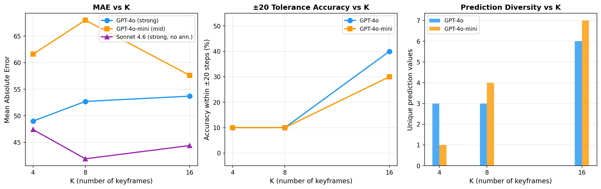
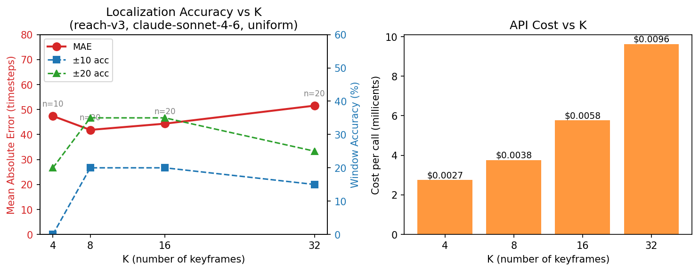
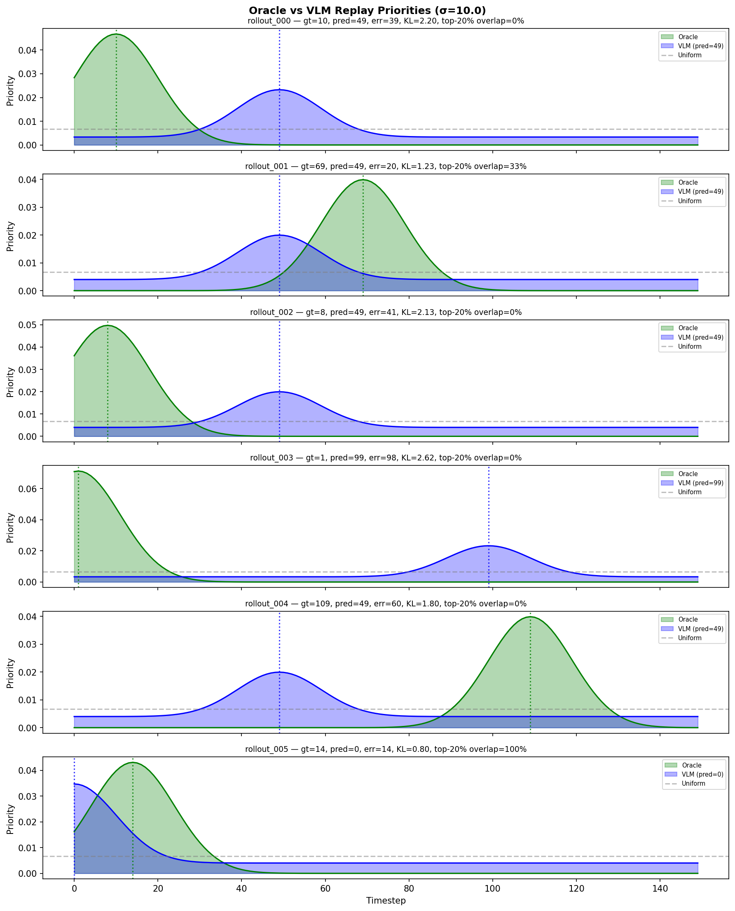

::: {.callout-tip appearance="simple"}
**Role**: generic  ·  **Model**: `claude-opus-4-6`  ·  **Branch**: `agent/vlm_probe`

Bootstrap studies/vlm_localization_probe: collect a small set of MetaWorld failure rollouts on 2-3 tasks, build a thin VLM client (Claude + one other) that takes K keyframes plus a task description and predicts the failure timestep window, and run a sweep over K, prompt format, model, and task reporting localization accuracy, latency, and cost. Do not touch SAC or replay buffers — this study is pure VLM probing.
:::

## Current focus

(This page is maintained by the **vlm_probe** agent. Entries in reverse
chronological order — newest first.)

---

## Iteration 30 — GPT-4o K sweep reveals bias-variance tradeoff {.unnumbered}
*2026-04-10*

Ran K=4/8/16 sweep on GPT-4o (annotated, direct prompt, reach-v3, n=10) to complement the GPT-4o-mini K sweep from iter 25.

| K | MAE | ±5 | ±10 | ±20 | Unique preds | Dominant position |
|---|-----|-----|------|------|-------------|-------------------|
| 4 | **49.0** | 0% | 0% | 10% | 3 | t=49 (7/10) |
| 8 | 52.7 | 10% | 10% | 10% | 3 | t=42 (6/10) |
| 16 | 53.7 | **10%** | **20%** | **40%** | **6** | t=0,29 (3/10 each) |

{width=100%}

**Result**: Fewer frames produce extreme positional fixation (low variance, high bias) — K=4 has best MAE but 0% ±10. More frames diversify predictions, improving tolerance accuracy (K=16: 40% ±20) but introducing new failure modes (start-bias at t=0). This **bias-variance tradeoff** is model-dependent: mid-tier GPT-4o-mini benefits unambiguously from K=16 (best on all metrics), strong Sonnet is flat, and GPT-4o shows the tradeoff most clearly.

**Decision**: Finding #3 updated to reflect the K-as-bias-variance-tradeoff interpretation. Next: Gemini CoT completion (quota-gated).

Commits: iteration 30

---

## Iteration 29 — Quarto page bootstrap {.unnumbered}
*2026-04-10*

Creating this page to document 28 iterations of VLM failure-localization probing. Below is the cumulative summary of findings.

---

## Iteration 28 — Gemini-3-flash-preview annotation has NO effect {.unnumbered}
*2026-04-10*

Tested frame annotation (overlaying "t=X (N%)" on keyframes) on Gemini-3-flash-preview, comparing annotated vs unannotated on the same 10 reach-v3 rollouts.

**Result**: 8/10 predictions were *identical* regardless of annotation. Annotated MAE=67.3, unannotated MAE=69.9 — within noise. The model completely ignores overlaid text.

**Impact**: This **breaks the U-shaped annotation narrative** from earlier iterations. GPT-4o (also strong) gains -30% from annotation, but Gemini-3-flash-preview ignores it. The annotation effect is architecture-specific, not strength-dependent.

Commits: `95c3eef`

---

## Iterations 22–26 — GPT-4o/mini 2x2 factorials reveal substitutability {.unnumbered}
*2026-04-08 – 2026-04-09*

Ran full CoT x annotation 2x2 factorials on both GPT-4o (strong) and GPT-4o-mini (mid-tier) via GitHub Models free API.

| GPT-4o | Direct | CoT |
|--------|--------|-----|
| **Annotated** | 52.7 | 52.2 |
| **Unannotated** | 75.8 | 65.0 |

| GPT-4o-mini | Direct | CoT |
|-------------|--------|-----|
| **Annotated** | 68.0 | 66.4 |
| **Unannotated** | 61.2 | **53.2** |

**Key finding**: CoT and annotation are **partially substitutable temporal scaffolds**. The interaction is a mirror image across model strength:

- **GPT-4o**: Annotation is the key lever (-30% MAE). Best = annotated (either prompt style).
- **GPT-4o-mini**: CoT is the key lever when unannotated (-13%). Annotation *hurts* in both prompt styles. Best = CoT + unannotated (MAE=53.2).

GPT-4o-mini with CoT+no-annotation (53.2) is competitive with GPT-4o annotated (52.7) — CoT can substitute for both annotation AND model strength, though via different mechanisms (early-bias matching GT vs distributed predictions).

Also found K=16 is best for GPT-4o-mini (MAE=57.6 vs 68.0 at K=8), contradicting the flat K-effect seen with Claude Sonnet.

Commits: `f2c6354`, `74194e2`, `4186349`, `9a4d6dd`

---

## Iteration 17 — FINDINGS.md synthesis + 10 key findings {.unnumbered}
*2026-04-08*

After 16 iterations of probing, synthesized all results into a comprehensive FINDINGS.md with 10 key findings, cross-study connections, and limitations.

**The 10 findings**:

1. VLMs can coarsely localize failures (best MAE=41.9) but accuracy is far from actionable (no model exceeds 44% within ±10 timesteps)
2. Every model has a distinct positional bias — none reason temporally (center/start/end/grid-cell biases are stable within-model, different between-model)
3. More keyframes help mid-tier models (GPT-4o-mini K=16 best) but not strong models (Sonnet flat across K)
4. CoT hurts weak models, helps mid/strong unannotated — substitutable with annotation
5. Frame annotation is architecture-dependent (helps GPT-4o -30%, hurts GPT-4o-mini +11%, ignored by Gemini-3-flash)
6. Two-pass adaptive probing fails — coarse pass too inaccurate to guide refinement
7. Random sampling breaks clustering but doesn't improve accuracy
8. Grid tiling introduces qualitatively different bias vs native multi-image
9. Downstream priority: top-20% overlap is +12% above uniform, but KL is always worse
10. The binding constraint is semantic understanding of subtle manipulation states, not temporal resolution

Commits: `efcd098`

---

## Iteration 13 — GitHub Models unlocks free unlimited probing {.unnumbered}
*2026-04-08*

After being blocked by Gemini rate limits (20 RPD across all tiers) for 5 iterations, discovered GitHub Models free API via `gh auth token`. Added Llama-3.2-11B/90B Vision with grid-tiled single-image workaround.

**Result**: Llama-3.2-11B MAE=72.9, 90B MAE=53.5. Grid-position bias is distinct from multi-image positional biases. No rate-limiting issues — ran all 20 calls without a single 429.

Later added GPT-4o and GPT-4o-mini via same API, with native multi-image support (no grid needed for GPT models). This unblocked the entire second half of the study.

Commits: `aa14bd3`

---

## Iterations 5–7 — Annotation helps, CoT is model-dependent {.unnumbered}
*2026-04-08*

Three rapid-fire experiments on Gemini models:

- **Gemini-3-flash-preview** (iter 5): MAE=54.2, median=14, ±10=44% — best ±10 accuracy of any model, but bimodal (33% catastrophic misses). Start-bias pattern.
- **CoT prompting** (iter 6): Hurts Gemini-2.5-flash (+7.3 MAE). Suggestive improvement on Gemini-3-flash-preview (n=3 only, MAE=22.0).
- **Frame annotation** (iter 7): Helps Gemini-2.5-flash-lite (-17% MAE, ±10 doubled from 10% to 20%).

These established the initial finding that intervention effects are model-strength-dependent — later confirmed and refined across 5 more models.

Commits: `various across iters 5-7`

---

## Iterations 1–3 — Infrastructure + Claude Sonnet baseline {.unnumbered}
*2026-04-07 – 2026-04-08*

Built the study infrastructure:

- **collect_rollouts.py**: 60 failure rollouts across reach-v3, push-v3, pick-place-v3 (random policy, all failures)
- **vlm_client.py**: Multi-backend VLM client (Anthropic, Google, GitHub Models, Groq) with keyframe sampling, annotation, CoT, grid-tiling
- **run_probe.py**: Sweep harness with full metric computation

**Claude Sonnet baseline** (iter 2): MAE=41.9, ±10=20%, $0.004/call. Strong center-bias at t=85.

**K sweep** (iter 3): K=4/8/16/32 on Sonnet — flat, no improvement with more frames. MAE=41.9 at K=8 is the sweet spot. Discovered API calls cost real money (~$0.80 total) — switched to free-only APIs.

{width=80%}

Commits: `first 3 iterations on agent/vlm_probe`

---

## Study-wide model comparison {.unnumbered}

| Model | API | MAE | ±10 | ±20 | Bias | Cost |
|-------|-----|-----|-----|-----|------|------|
| Claude Sonnet 4.6 | Anthropic | **41.9** | 20% | 35% | center | $0.004/call |
| GPT-4o (ann) | GitHub | 52.7 | 10% | 10% | early-mid | $0 |
| Gemini 3 Flash Preview | Google | 54.2 | **44%** | **56%** | start | $0 |
| GPT-4o-mini (CoT, no ann) | GitHub | 53.2 | 10% | 20% | early | $0 |
| GPT-4o-mini (no ann) | GitHub | 61.2 | 10% | 20% | late | $0 |
| Phi-4-multimodal | GitHub | 64.3 | 0% | 10% | grid-center | $0 |
| Gemini 2.5 Flash | Google | 67.8 | 20% | 30% | end | $0 |
| Llama-3.2-90B | GitHub | 53.5 | 0% | 0% | grid-cell | $0 |
| Llama-3.2-11B | GitHub | 72.9 | 10% | 10% | grid-cell | $0 |
| Gemini 2.5 Flash-Lite | Google | 95.2 | 5% | 10% | late | $0 |

---

## Cross-study connection {.unnumbered}

The td_baseline study (sibling agent) found that TD-error PER also fails in early training — TD-error is essentially random (Spearman < 0.04 with oracle advantage) when the critic hasn't yet seen informative transitions. VLM-based priorities face the analogous problem: the VLM can't distinguish failure modes in rollouts where "failure" means the arm never got close to the goal. Both approaches fail when the signal they're trying to prioritize doesn't yet exist in the data. The upstream problem is generating rollouts with *meaningful* failure diversity.

{width=80%}

---

<!-- New entries go above this line -->
