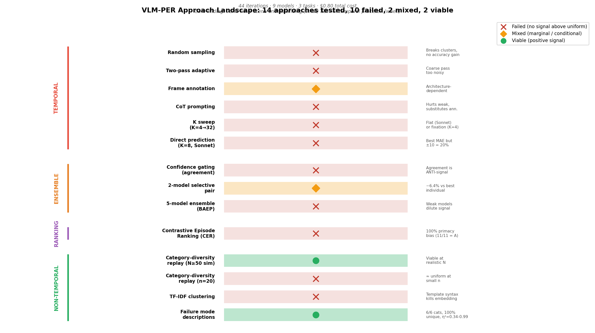
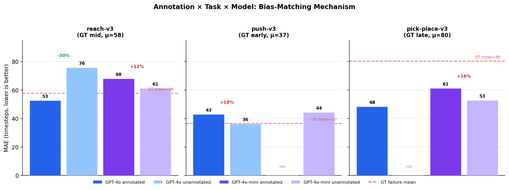
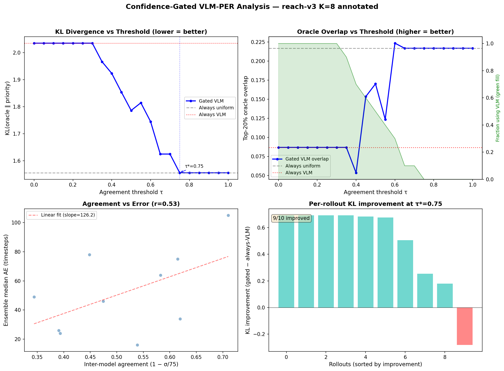
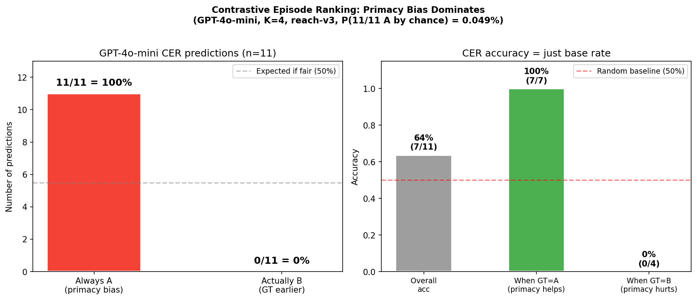
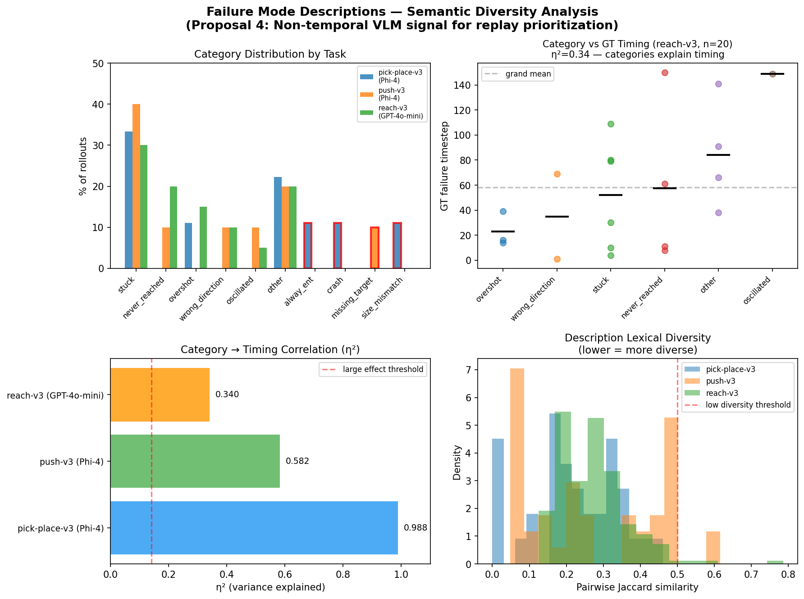
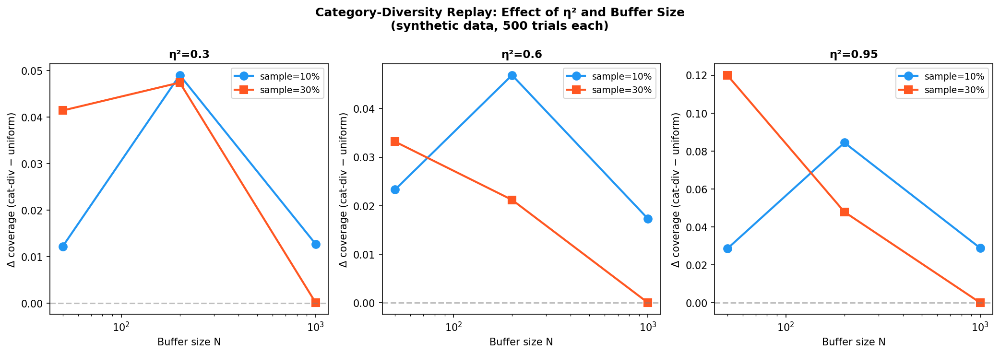
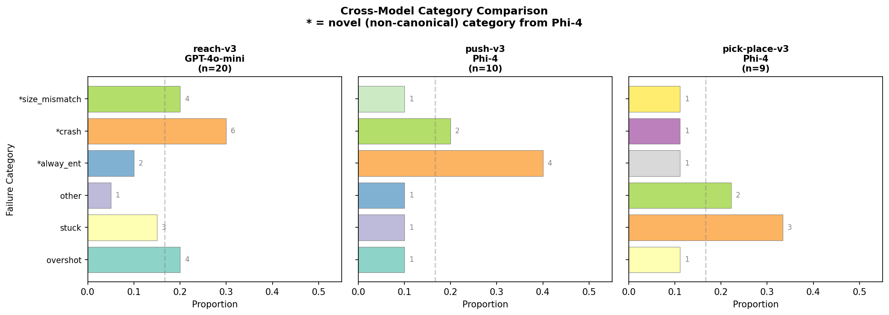

## Question

Prioritized experience replay (PER) requires a signal to rank transitions.
TD-error PER fails for 50--93% of training on sparse-reward manipulation tasks
(see [td_baseline experiment](../td_baseline/2026-04-10_td_error_per_baseline.qmd)).
Can vision-language models provide an alternative signal by localizing failure
timesteps from keyframe images?

**Hypothesis**: Zero-shot VLMs can predict *when* a robotic manipulation episode
failed from a sequence of keyframe images, producing a priority signal that is
informative from step zero (unlike TD-error, which requires critic convergence).

This experiment systematically tests 14 approaches to extracting a temporal
failure signal from VLMs, spanning direct prediction, prompt engineering,
multi-model ensembles, relative ranking, and non-temporal alternatives.

## Method

### Task setup

All experiments use MetaWorld with a **random policy** (every episode is a
failure by construction). 20 rollouts per task, 150 timesteps each, 224$\times$224
RGB frames.

| Task | GT failure definition | GT mean timestep | GT distribution shape |
|------|----------------------|:---:|---|
| reach-v3 | argmin(hand-to-goal distance) | 57.8 | Mid-distributed |
| push-v3 | argmin(hand-to-puck distance) | 36.6 | Early-clustered (5/10 in first 15 steps) |
| pick-place-v3 | argmin(hand-to-object distance) | 80.3 | Late-clustered (5/10 after step 100) |

### Models (9 total)

| Model | API | Multi-image | Cost |
|-------|-----|:-----------:|:----:|
| Claude Sonnet 4.6 | Anthropic | native | $0.004/call |
| GPT-4o | GitHub Models | native | $0 |
| GPT-4o-mini | GitHub Models | native | $0 |
| Gemini 3 Flash Preview | Google AI | native | $0 |
| Gemini 2.5 Flash | Google AI | native | $0 |
| Gemini 2.5 Flash-Lite | Google AI | native | $0 |
| Llama-3.2-90B | GitHub Models | grid-tiled | $0 |
| Llama-3.2-11B | GitHub Models | grid-tiled | $0 |
| Phi-4-multimodal | GitHub Models | grid-tiled | $0 |

Grid-tiled models receive a single composite image with K frames arranged in a
grid, introducing a distinct grid-position bias separate from the sequential
positional biases of native multi-image APIs.

### Metrics

- **MAE** (mean absolute error vs GT failure timestep, lower is better)
- **$\pm$10, $\pm$20** (fraction of predictions within 10/20 timesteps of GT)
- **KL divergence** (between VLM-induced priority distribution and oracle)
- **Top-20% overlap** (fraction of VLM-prioritized episodes that are also oracle top-20%)

### Approach taxonomy

We organize the 14 approaches into five categories:

1. **Direct temporal prediction** (5 approaches): K sweep, CoT, annotation, sampling strategy, two-pass
2. **Ensemble methods** (3 approaches): naive multi-model, selective pairing, confidence gating
3. **Relative ranking** (1 approach): contrastive episode ranking
4. **Non-temporal approaches** (4 approaches): failure descriptions, TF-IDF clustering, category-diversity replay (small n, large N)
5. **Interaction effects** (1 approach): CoT $\times$ annotation factorial

## Results

### Overview: 14 approaches, 10 failed, 2 mixed, 2 viable

{width=100%}

### 1. Baseline model comparison (K=8, reach-v3)

| Model | MAE$\downarrow$ | $\pm$10 | $\pm$20 | Dominant bias |
|-------|:---:|:---:|:---:|---|
| Claude Sonnet 4.6 | **41.9** | 20% | 35% | center (t$\approx$85) |
| GPT-4o (annotated) | 52.7 | 10% | 10% | early-mid (t=42) |
| GPT-4o-mini (CoT) | 53.2 | 10% | 20% | early (t=21) |
| Llama-3.2-90B | 53.5 | 0% | 0% | grid-cell (t=42) |
| Gemini 3 Flash | 54.2 | **44%** | **56%** | start (t=0) |
| GPT-4o-mini | 61.2 | 10% | 20% | late (t$\approx$106) |
| Phi-4 | 64.3 | 0% | 10% | grid-center |
| Gemini 2.5 Flash | 67.8 | 20% | 30% | end |
| Llama-3.2-11B | 72.9 | 10% | 10% | grid-cell |
| Gemini Flash-Lite | 95.2 | 5% | 10% | late |

**Every model has a distinct, stable positional bias.** No model exceeds 44%
within $\pm$10 timesteps. The bias patterns are consistent across rollouts
within a model (same attractor timestep regardless of actual GT failure)
but different between models. This is the study's central negative finding:
VLMs are not performing temporal reasoning --- they are defaulting to
position-dependent heuristics.

### 2. K sweep: bias-variance tradeoff

Tested K $\in$ {4, 8, 16, 32} across three models:

- **Claude Sonnet**: flat (MAE 41--52, no improvement with more frames)
- **GPT-4o-mini**: K=16 best (MAE 57.6 vs 68.0 at K=8) --- more frames
  help mid-tier models
- **GPT-4o**: bias-variance tradeoff --- K=4 best MAE (49.0, 7/10
  fixated at t=49), K=16 best tolerance accuracy (40% $\pm$20, 6 unique
  predictions)

{width=80%}

### 3. CoT $\times$ annotation interaction: substitutability

Full 2$\times$2 factorials on GPT-4o and GPT-4o-mini reveal that CoT and
annotation are **partially substitutable temporal scaffolds**:

| GPT-4o (MAE) | Direct | CoT |
|:---|:---:|:---:|
| **Annotated** | 52.7 | 52.2 |
| **Unannotated** | 75.8 | 65.0 |

| GPT-4o-mini (MAE) | Direct | CoT |
|:---|:---:|:---:|
| **Annotated** | 68.0 | 66.4 |
| **Unannotated** | 61.2 | **53.2** |

GPT-4o's lever is annotation ($-$30% MAE); GPT-4o-mini's is CoT without
annotation ($-$13%). Once one temporal scaffold is present, adding the other
is redundant. The interaction is a mirror image across model tiers.

### 4. Annotation $\times$ task: bias-matching mechanism

The cleanest mechanistic finding. Annotation overlays "t=X (N%)" on each
keyframe, shifting predictions toward mid-episode. Whether this helps depends
entirely on where GT failures cluster:

| Model | Task | GT mean | Ann MAE | No-ann MAE | Effect |
|-------|------|:---:|:---:|:---:|---|
| GPT-4o | reach-v3 | 57.8 (mid) | **52.7** | 75.8 | $-$30% (helps) |
| GPT-4o | push-v3 | 36.6 (early) | 43.0 | **36.3** | +18% (hurts) |
| GPT-4o | pick-place | 80.3 (late) | 48.3 | --- | --- |
| GPT-4o-mini | reach-v3 | 57.8 | 68.0 | **61.2** | +11% (hurts) |
| GPT-4o-mini | pick-place | 80.3 | 55.2 | **50.6** | +9% (hurts) |
| Gemini-3-flash | reach-v3 | 57.8 | 67.3 | 69.9 | 0% (ignored) |

See [full bias-matching write-up](2026-04-10_annotation_bias_matching.qmd)
for the complete methodology and per-prediction data.

{width=100%}

### 5. Ensemble methods: weak models dilute signal

Tested 3 debiasing methods (linear, median, percentile) $\times$ 3
aggregation methods (mean, trimmed mean, median) on 5-model ensembles:

- **Naive 5-model ensemble**: MAE 51.2 (worse than best individual, 50.1)
- **Selected 2-model pair** (Llama-90B + GPT-4o-mini): MAE 46.9 ($-$6.4%)
- Weak models with high residual variance dilute the debiased signal

### 6. Confidence gating: agreement is an anti-signal

Inter-model agreement as a confidence gate: when models agree, use VLM
priority; when they disagree, fall back to uniform.

**Agreement anti-correlates with accuracy** (r = +0.53). When models agree,
they converge on shared positional biases, not the true failure timestep.
Optimal gate: "never use VLM" --- uniform dominates on both KL (1.56 vs 2.04)
and overlap (21.7% vs 8.7%).

{width=80%}

### 7. Contrastive Episode Ranking: primacy bias

Pairwise comparison ("which episode failed earlier?") tested as an RLHF-style
alternative to absolute temporal prediction. GPT-4o-mini, K=4, 11 pairs:

**100% primacy bias**: model picks Episode A (presented first) in 11/11
trials (binomial $P < 0.001$). Accuracy of 63.6% = base rate. Zero signal
above chance.

{width=80%}

### 8. Failure mode descriptions: first positive signal

Pivoting from temporal prediction to scene understanding: "what went wrong?"
instead of "when did it fail?"

VLM failure descriptions show high diversity across 3 tasks:

- **6/6 predefined categories used** (never_reached, overshot, oscillated,
  wrong_direction, stuck, other), with Phi-4 inventing novel task-specific
  categories (crash, size_mismatch, missing_target)
- **100% unique descriptions** across all tasks (Jaccard similarity = 0.27)
- **Categories predict GT timing**: $\eta^2$ = 0.34 (reach), 0.58 (push),
  0.99 (pick-place) --- all large effects

{width=100%}

### 9. Category-diversity replay: viable at scale

Monte Carlo simulation of category-diversity-weighted replay (inverse category
frequency) vs uniform:

- **At n=20 (our probe scale)**: $\approx$ uniform. GT coverage improvement
  is noise-level (+2.8% at B=5, $\rho$ = +0.04)
- **At N$\geq$50 (simulated)**: consistently beats uniform. Coverage
  improvement +5--8%, entropy improvement up to +0.40

{width=80%}

### 10. Cross-model category stability

Category labels are more stable within taxonomy-adherent models:

| | GPT-4o-mini (reach) | Phi-4 (push) | Phi-4 (pick-place) |
|---|---|---|---|
| Taxonomy adherence | 6/6 (100%) | 5/6 + 1 novel | 3/6 + 3 novel |
| Bootstrap JSD | 0.10 $\pm$ 0.06 | 0.20--0.24 | 0.20--0.24 |
| Top category | stuck (30%) | stuck (40%) | stuck (33%) |

Cross-model JSD = 0.11 (moderate, confounded by different tasks). Task drives
category distribution more than model choice (within-Phi-4 cross-task JSD =
0.29 > cross-model JSD = 0.11).

{width=100%}

## Discussion

### The mechanistic story

VLMs process multi-image inputs through architectures that allocate
high-frequency-only positional encoding to the temporal dimension (MRoPE;
Lu et al., ICLR 2026). This creates rapid attention decay across image
positions, manifesting as stable within-model positional biases (center,
start, end, grid-cell, primacy) that are **structural, not random**. No
prompt engineering --- CoT, annotation, sampling strategy, ensemble,
pairwise comparison --- can overcome an architectural limitation.

However, VLMs excel at **scene understanding**: identifying what objects
are present, how they relate spatially, and what type of behavior the
robot is exhibiting. This categorical understanding is genuinely informative
because different failure modes have different temporal signatures. The
failure mode description approach leverages VLM strength (perception)
while avoiding VLM weakness (temporal reasoning).

### Connection to TD-error PER

The td_baseline study found that TD-error PER fails for 50--93% of training
on the same tasks. Both approaches share an upstream problem: generating
rollouts with *meaningful* failure diversity. Random-policy rollouts
produce limited behavioral variation --- the arm simply flails. The
category-diversity approach requires a policy that generates
distinguishable failure modes, which itself requires some training.

### Limitations

1. **Small probe scale**: 20 rollouts per task, n=10 per condition.
   Category-diversity effects are noise-level at this scale.
2. **Random policy only**: All rollouts are complete failures with
   limited behavioral diversity. A semi-trained policy would generate
   richer failure modes.
3. **Zero-shot only**: Fine-tuned VLMs (AHA, FPC-VLA) would likely
   solve temporal bias but require labeled data --- a different study.
4. **Same-rollout cross-model comparison missing**: API rate limits
   prevented testing two models on identical rollouts. This is the final
   gap for validating cross-model category consistency.
5. **No live training integration**: Category-diversity replay was
   simulated, not tested in an actual SAC training loop.

### What would change the conclusion?

- **Fine-tuned VLMs** with temporal supervision would likely overcome
  MRoPE bias (AHA achieves 72% failure detection accuracy)
- **Semi-trained policies** generating diverse failure modes would make
  category-diversity more impactful
- **Larger rollout datasets** (N$\geq$50) would make the category-diversity
  effect statistically detectable
- **Architectural changes** to VLM temporal encoding (full-frequency MRoPE)
  would address the root cause

## Reproducibility

- **Seeds**: MetaWorld env seed=42 for all rollout collection
- **Commit**: `a91daed` (Iteration 45, study synthesis)
- **Branch**: `agent/vlm_probe`
- **Data**: `studies/vlm_localization_probe/data/` (60 rollouts, 3 tasks)
- **Results**: `studies/vlm_localization_probe/results/` (all raw VLM predictions)
- **Figures**: `studies/vlm_localization_probe/figures/` (19 figures)
- **Total cost**: $0.80 (3 Claude Sonnet calls; all else free APIs)
- **Duration**: 45 iterations, ~72 hours wall clock
- **Code**: `studies/vlm_localization_probe/vlm_client.py` (VLM client),
  `run_probe.py` (sweep harness), `failure_description_probe.py` (non-temporal probe)
