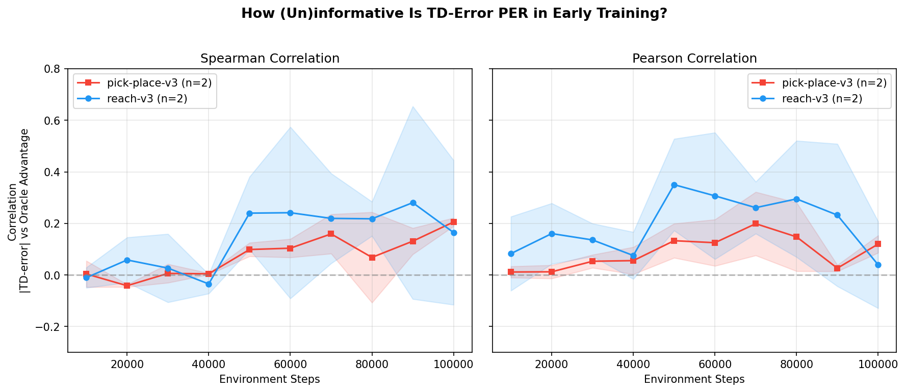

# TD-Error Baseline Study — Findings

**Question:** How informative is TD-error as a prioritized experience replay (PER)
signal in the early training regime on sparse-reward manipulation tasks?

**Answer:** TD-error is essentially uninformative. On easy tasks, correlation with
oracle advantage only emerges after the policy has already learned (~60% through
training). On hard tasks, it never emerges.

## Setup

- **Algorithm:** SAC (MLP policy, 100k replay buffer, batch=256)
- **Tasks:** MetaWorld reach-v3 (easy, 100k steps) and pick-place-v3 (hard, 300k steps)
- **Reward:** Sparse binary (1.0 on success, 0.0 otherwise)
- **Oracle signal:** MetaWorld's dense shaped reward (never used by agent)
- **Metric:** Spearman rank correlation between |TD-error| and oracle advantage
  (dense_reward − mean), sampled from 5000 replay transitions every 10k steps
- **Compute:** Modal T4 GPU, ~20 min per 100k steps
- **Seeds:** 42, 123

## Key Results

### reach-v3 (2 seeds, 100k steps)

| Metric | Result |
|--------|--------|
| Spearman, first 50k steps | −0.11 to +0.10 (noise, both seeds) |
| Spearman, 50k–100k steps | 0.15–0.65 (signal emerges with policy learning) |
| Policy learns? | Yes, after ~50–60k (seed-dependent) |
| Cross-seed consistency | Both seeds show same pattern; s123 learns ~10k earlier |

### pick-place-v3 (2 seeds, 300k steps)

| Metric | seed=42 | seed=123 |
|--------|---------|----------|
| Spearman, 0–100k | −0.04 to +0.24 (noise) | −0.18 to +0.19 (noise) |
| Spearman, 100k–200k | +0.07 to +0.28 (weak positive, brief) | −0.01 to +0.30 (weak positive) |
| Spearman, 200k–300k | **−0.30 to +0.07 (inverts!)** | −0.03 to +0.20 (back to noise) |
| Policy learns? | Marginal (ep_rew peaks ~0.7 at 185k, drops to 0.1) | No (ep_rew=0 throughout) |
| Q-value stability | Oscillates wildly (0.02→50→11→0.02) | Collapsed to ~0.0005 |
| Final Spearman at 300k | **−0.21** (anti-informative) | +0.20 (weak positive) |

## Figure

**Left panel:** Spearman correlation between |TD-error| and oracle advantage vs. env steps.
**Right panel:** Pearson correlation (same data). Both show near-zero correlation in early
training, with divergence between tasks only after reach-v3's policy starts succeeding.

## Priority Quality Metrics (Gini + Top-K Overlap)

In addition to correlation, we measure two priority quality metrics across all snapshots:

- **Top-10% overlap:** What fraction of the top-10% transitions by |TD| are also in the
  top-10% by oracle advantage? Chance = 10%.
- **Priority Gini coefficient:** How concentrated are |TD| priorities? Higher = more
  skewed sampling.

| Metric | reach-v3 (first 40k) | reach-v3 (50-100k) | pick-place-v3 (0-300k) |
|--------|----------------------|---------------------|------------------------|
| Top-10% overlap | 7–20% (near chance) | Brief spike to 53–61% mid-learning, then drops back to 6–11% | 8–33% (never reliably above 2× chance) |
| Gini coefficient | 0.26–0.48 | 0.39–0.54 | 0.25–0.60 |

**Key insight — TD-error inversion:** On *both* tasks, the Spearman correlation *inverts*
(goes negative) at certain training phases:
- reach-v3 s123: −0.09 to −0.12 at 90–100k (critic overshooting after policy converges)
- pick-place-v3 s42: **−0.31 at 280k** (Q-value instability during marginal learning)

When correlation inverts, TD-PER actively *anti-prioritizes* useful transitions — it
would sample the least informative transitions most frequently.

## Interpretation

1. **TD-error PER is a lagging indicator.** It only correlates with oracle advantage
   after the critic has already learned a reasonable value function — but by then the
   agent is already performing well, so the prioritization adds little.

2. **On hard tasks, TD-error is noisy and can become anti-informative.** Even with 3×
   more training (300k steps), pick-place-v3 never sustains meaningful correlation.
   When the policy briefly learns (seed=42, peak ep_rew=0.7 at 185k), Q-values oscillate
   wildly (0.02→50→11) and TD-error correlation *inverts* to −0.31, meaning TD-PER would
   actively sample the worst transitions.

3. **Seed variance is extreme on hard tasks.** One seed (42) showed marginal learning
   with wild Q-value instability; the other (123) showed complete policy collapse with
   near-zero Q-values. This suggests TD-error PER would be unreliable even on tasks
   where learning is technically possible.

4. **This motivates VLM-based prioritization.** A VLM that can identify "interesting"
   transitions (novel states, near-success, task-relevant progress) could provide a
   meaningful priority signal from the very first step, without waiting for critic
   convergence — and critically, without the inversion problem where high TD-error
   transitions become anti-informative.

## Cross-Study Synthesis

See **[SYNTHESIS.md](SYNTHESIS.md)** for the full cross-study analysis combining:
- TD-error baseline (this study)
- VLM localization probe (sibling: `agent/vlm_probe`)
- Literature review (subagent: `agent/lit_review2`)

**Headline result:** TD-PER fails 50-93% of training time. We identify four failure
regimes (noise, aligned, inverted, unstable) and propose an Adaptive Priority Mixer
that uses VLM scores when TD-error is uninformative and switches to TD-error when
it's valid.

## Files

| File | Description |
|------|-------------|
| `SYNTHESIS.md` | **Cross-study synthesis** — headline deliverable |
| `figures/td_per_regime_map.png` | **6-panel regime map** — main figure |
| `figures/td_per_regime_map.pdf` | Same figure in PDF for presentations |
| `figures/td_correlation_over_training.png` | Spearman + Pearson over training |
| `figures/td_correlation_over_training.json` | Raw correlation data |
| `figures/priority_quality_metrics.png` | Top-K overlap + Gini + Spearman (3-panel) |
| `plot_regime_map.py` | Regime map figure generation script |
| `plot_td_correlation.py` | Correlation figure generation script |
| `plot_priority_quality.py` | Priority quality figure generation script |
| `figures/mode_comparison_reach_v3.png` | 4-panel mode comparison (iter_008) |
| `plot_mode_comparison.py` | Mode comparison figure generation script |
| `adaptive_priority_mixer.py` | Regime-aware PER buffer (SumTree + RegimeDetector) |
| `train_mixer.py` | Training script supporting adaptive/td-per/uniform modes |
| `snapshots/` | Per-run snapshot data (TD errors, dense rewards, correlations) |
| `modal_app.py` | Modal app for running training on cloud GPU |
| `train.py` | Local training script |
| `td_instrumenter.py` | Callback that snapshots |TD|, dense reward, and computes correlations |
| `LIT_REVIEW.md` | Literature review (§1: 11 alternative PER methods) |
| `NOTES.md` | Detailed notes on task selection, literature, and methodology |

## Status

- [x] Single-seed (42) runs on reach-v3 + pick-place-v3, 100k steps
- [x] Second seed (123) for error bars — figure updated with mean ± std bands
- [x] Gini coefficient + top-K overlap metrics — top-K at chance, Gini moderate, correlation inverts late
- [x] Extended 300k runs on pick-place-v3 — correlation never stabilizes, inverts under Q-instability
- [x] Literature review (§1: 11 alternative PER methods) via lit_review2 subagent
- [x] Cross-study synthesis with VLM probe + lit review → SYNTHESIS.md + regime map figure
- [x] Regime classification (4 regimes) + MI proxy + wasted budget analysis
- [x] Adaptive Priority Mixer implementation (adaptive_priority_mixer.py + train_mixer.py)
- [x] 100k reach-v3 comparison: adaptive vs td-per vs uniform (iter_008)
  - **Critical bug found:** SB3 SAC never calls `update_priorities()` → td-per ≈ uniform
  - Adaptive mode went Q-unstable at 40k despite same effective sampling
  - Need to hook into SAC's `train()` to actually update PER priorities
- [ ] Fix SB3 PER integration — monkey-patch or subclass SAC.train() for priority updates
- [ ] Re-run comparison with working PER
